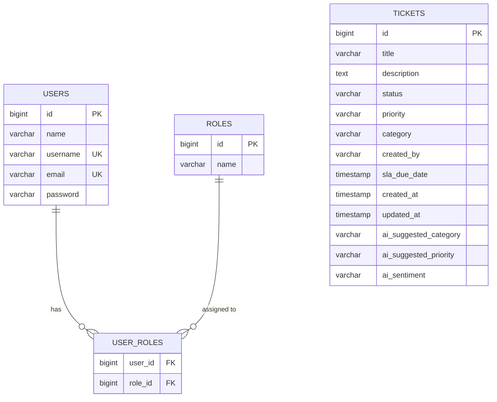

# Database Design Document
## AI-Assisted Customer Support Ticketing System

### 1. Overview
This document outlines the database schema, tables, and relationships for the Customer Support Ticketing System. The design utilizes a Relational Database Management System (RDBMS) to ensure data integrity and ACID properties.

---

### 2. Entity Relationship Diagram (ERD)

> **Note**: Currently, `TICKETS` links to users via the `created_by` column (storing the username) rather than a direct foreign key to `USERS.id`. This loose coupling simplifies initial implementation but enforces application-level referential integrity.

---

### 3. Table Definitions

#### 3.1 `users`
Stores all registered users (Customers, Agents, Admins).

| Column Name | Data Type | Constraints | Description |
| :--- | :--- | :--- | :--- |
| `id` | `BIGSERIAL` | **PK**, Not Null | Unique identifier. |
| `name` | `VARCHAR(255)` | | Full name of the user. |
| `username` | `VARCHAR(255)` | **Unique**, Not Null | System username for login. |
| `email` | `VARCHAR(255)` | **Unique**, Not Null | Email address for contact/notifications. |
| `password` | `VARCHAR(255)` | Not Null | BCrypt hashed password. |

#### 3.2 `roles`
Defines available system roles (e.g., `ROLE_USER`, `ROLE_ADMIN`).

| Column Name | Data Type | Constraints | Description |
| :--- | :--- | :--- | :--- |
| `id` | `BIGSERIAL` | **PK**, Not Null | Unique identifier. |
| `name` | `VARCHAR(60)` | | Role name (e.g., ROLE_ADMIN). |

#### 3.3 `user_roles`
Join table for Many-to-Many relationship between Users and Roles.

| Column Name | Data Type | Constraints | Description |
| :--- | :--- | :--- | :--- |
| `user_id` | `BIGINT` | **FK** -> `users(id)` | Reference to user. |
| `role_id` | `BIGINT` | **FK** -> `roles(id)` | Reference to role. |

#### 3.4 `tickets`
The core entity storing support ticket information.

| Column Name | Data Type | Constraints | Description |
| :--- | :--- | :--- | :--- |
| `id` | `BIGSERIAL` | **PK**, Not Null | Unique Ticket ID. |
| `title` | `VARCHAR(255)` | Not Null | Summary of the issue. |
| `description` | `TEXT` | Not Null, Length 5000 | Detailed explanation. |
| `status` | `VARCHAR(255)` | Check (Enum) | `OPEN`, `IN_PROGRESS`, `RESOLVED`, `CLOSED`, `ESCALATED`. |
| `priority` | `VARCHAR(255)` | Check (Enum) | `LOW`, `MEDIUM`, `HIGH`, `CRITICAL`. |
| `category` | `VARCHAR(255)` | Check (Enum) | `BILLING`, `TECHNICAL`, `FEATURE_REQUEST`, `GENERAL_INQUIRY`. |
| `created_by` | `VARCHAR(255)` | Not Null | Username of the creator. |
| `created_at` | `TIMESTAMP` | Default NOW() | Creation timestamp. |
| `updated_at` | `TIMESTAMP` | Default NOW() | Last update timestamp. |
| `sla_due_date` | `TIMESTAMP` | | Calculated deadline based on SLA policy. |
| `ai_suggested_category` | `VARCHAR(255)` | | Category predicted by AI. |
| `ai_suggested_priority` | `VARCHAR(255)` | | Priority predicted by AI. |
| `ai_sentiment` | `VARCHAR(255)` | | Sentiment analysis result (e.g., POSITIVE, NEGATIVE). |

---

### 4. Naming Conventions
- **Tables**: Plural, snake_case (e.g., `user_roles`).
- **Columns**: snake_case (e.g., `first_name`, `created_at`).
- **Primary Keys**: `id` (BigInt).
- **Foreign Keys**: `[table_singular]_id`.

### 5. Indexing Strategy
To ensure performance as data grows:

1.  **Unique Indexes**:
    - `users(username)`
    - `users(email)`
2.  **Performance Indexes** (Recommended for future):
    - `tickets(status)` - For filtering active tickets.
    - `tickets(created_by)` - For "My Tickets" queries.
    - `tickets(priority)` - For SLA monitoring.

